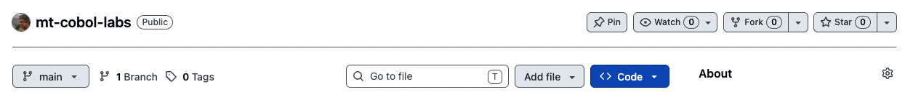

[Top](../README.md) => [Labs](../labs.md) => _Fork the class Github repository_ 

# Lab: Fork the class Github repository

A Github repository has been created to support your work in this class. In this lab, you'll fork the repository under your own Github ID so that you'll have a personal copy of it that you can modify and use as a future reference containing all your lab work. 

If you don't already have a Github ID, navigate to https://github.com and follow the instructions there to create one. 

Navigate to the class Github repository at https://github.com/neopragma/mt-cobol-labs and select the "Fork" button near the upper right-hand corner of the window. Then you can create a copy, or "fork," of the repository that you own and control.

